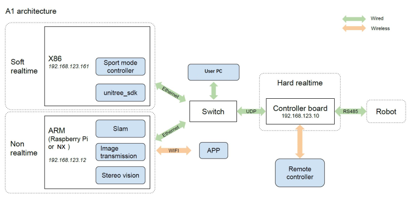
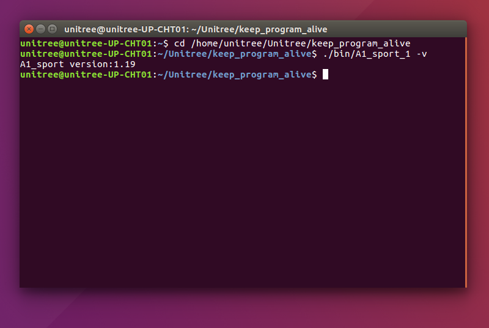
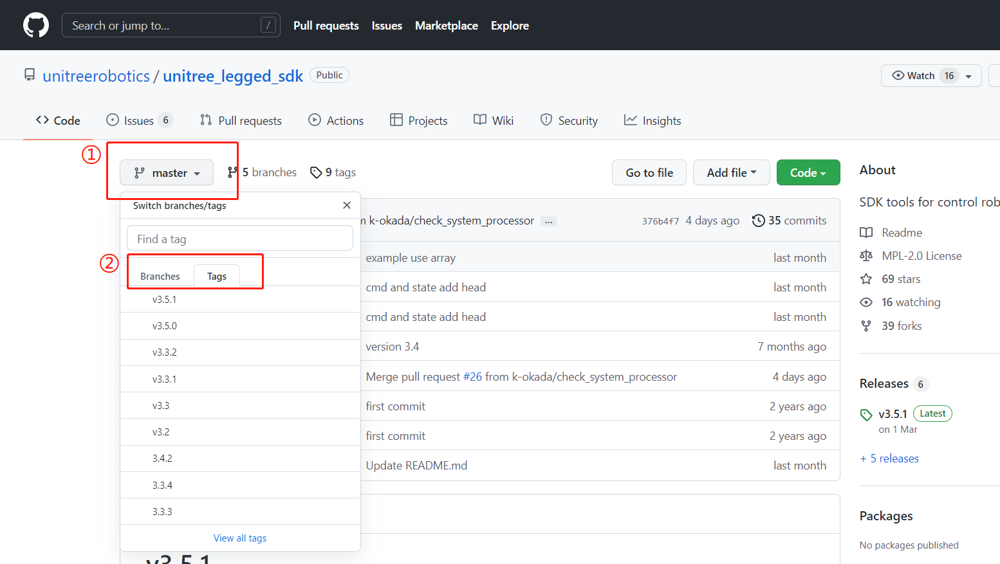
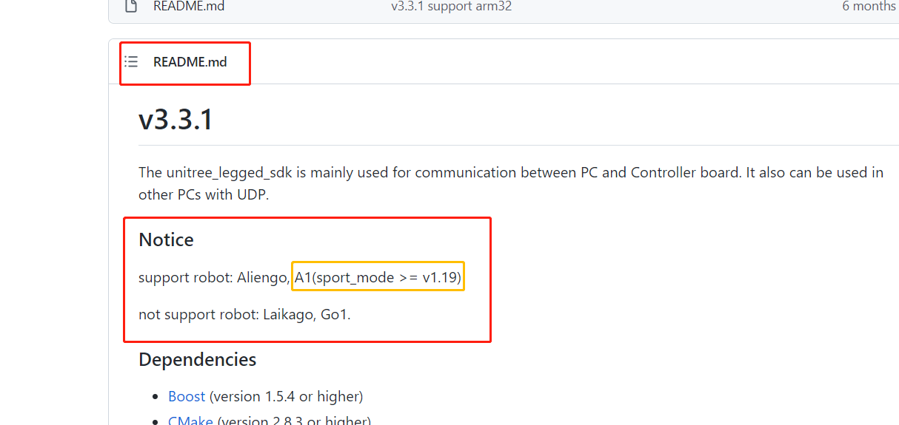
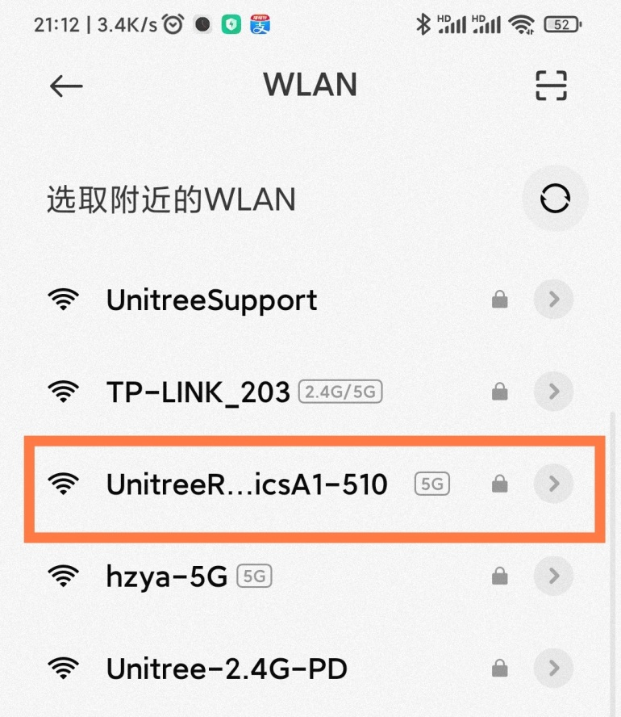
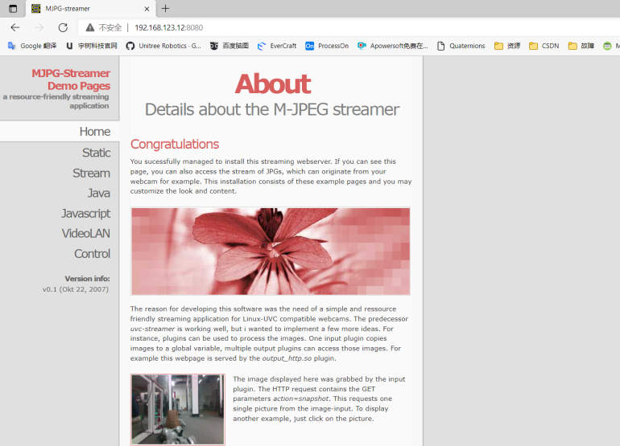
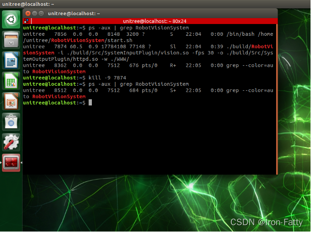
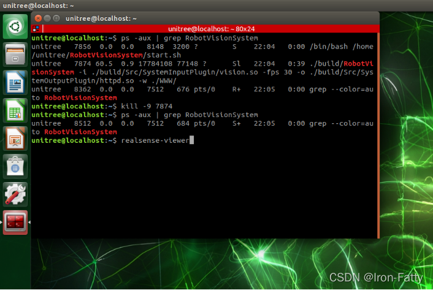
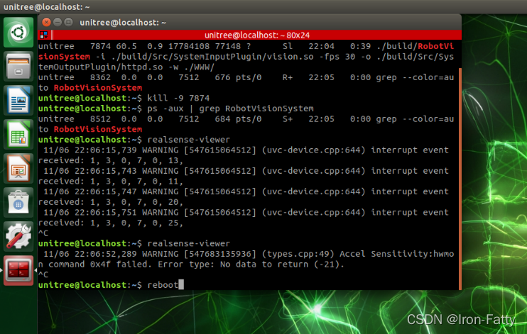

# A1

## 1. A1 system architecture diagram



Main control board: MCU (192.168.123.10)
Motion control board: Upboard (192.168.123.161)
Sense Board: RasPi 4B or TX2 or NX (192.168.123.12)

## 2. A1 Precautions for using SDK for development

### 2.1 exercise program version query

Connect the HDMI, mouse and keyboard of the Upboard, and open the terminal:

```
cd /home/unitree/Unitree/keep_program_alive
./bin/A1_sport_1 -v
```

Due to a bug in the Upboard hardware, there is no HDMI output after booting, so you need to plug in the HDMI before turning on the A1 and then turn it on.



### 2.2 SDK version selection and the running mode of the robot dog

According to the queried motion program version, select the corresponding sdk:

1. If the motion program ≤ 1.16, then:
Robot dog operating mode: **normal mode** (the robot dog stands up and is in normal mode after power-on self-inspection);

SDK package version: **v3.2** (unitree_legged_sdk that comes with the Upboard on the dog or downloaded from the Unitree GitHub  download address: https://github.com/unitreerobotics/unitree_legged_sdk/tree/v3.2);

ROS support: support unitree_ros and unitree_ros_to_real, unitree_ros_to_real version is v3.2.1, download address: [unitreerobotics/unitree_ros_to_real at v3.2.1 (github.com)](https://github.com/unitreerobotics/unitree_ros_to_real/tree/v3.2.1).

2. If the exercise program > 1.16, then:
Robot dog running mode: **sports mode** (the robot dog needs to switch to sports mode manually after power-on self-inspection, and does not support switching through SDK);

SDK package version: unitree_legged_sdk that comes with Upboard on the dog or download it from Unitree GitHub warehouse, download address: https://github.com/unitreerobotics/unitree_legged_sdk, select the corresponding SDK version according to the version of the motion program (the SDK readme contains Write motion program version requirements), see the figure below;

ROS support: Packaged ROS packages are no longer provided, and customers can call the SDK implementation in ROS by themselves.






### 2.3 SDK required dependencies and running permissions

Please read the Readme file carefully before use, which contains the dependencies required by the SDK and the method of compiling and running.
● depend on
See the readme file for the required dependencies;
If the system is on the dog, the required dependencies have been installed and can be compiled and used directly;
If you are on your own PC, you generally need to install LCM, and there are download links and installation methods in the readme.
● compile
See the readme file for the compilation method;
Before compiling, you need to modify the library file called in the CmakeList file, and choose amd64 or arm64 according to your own platform.
● run
See the readme file for usage;
To run the compiled file, sudo permission is required to lock the memory.

## 3. A1 SDK HighLevel Interfaces

Same as Go1 SDK HighLevel Interfaces

## 4. A1 RobotVisionSyetem Video Streaming Server

When using the robot dog, sometimes it is necessary to display the real-time picture of the dog on the big screen, which can be realized by using the web service provided by the built-in vision program.

1. Wait 3-5 minutes after A1 is turned on, then connect to the hotspot sent by the robot dog



2. After configuring the network settings of the App, you can view the camera information in the App

3. The image information can also be obtained through the browser, the link is http://NX or the IP of Raspberry Pi:8080 (the default address is http://192.168.123.12:8080)



4. The direct default video stream address is:
http://192.168.123.12:8080/?action=stream

PS:
This service uses the webpage service that comes with the visual service, so you must first ensure that the built-in visual program is in normal use.

Secondly, any IP address of the perception board (NX or Raspberry Pi for A1, TX2 for AlienGo) can be accessed. Therefore, the sensor board can be connected to other wireless networks, and the computer or large screen that needs to display the video stream is also connected to the same network, which can be realized by using the above method. The stream address is the address of the sensor board under this network.

## 5. A1 calls the camera through realsense-viewer

When using the robot dog, sometimes it is necessary to view the calling camera through the system on NX or Raspberry Pi, which can be viewed through the realsense-viewer provided by realsense. However, the vision program that comes with the robot dog will start up and occupy the camera, so you need to kill this process first. The NX system is used as an example below, and the Raspberry Pi is the same.

1. Open the terminal, query the process number of the visual application through the ps command, and kill the process through the kill command

```
ps -aux | grep RobotVisionSystem
kill -9 7874   #
```



2. Enter the realsense-viewer command to call the camera program

   ```
realsense-viewer
   ```

   

3. After using, return to the terminal window, Ctrl+C to end the program



4. Restart the robot dog to restore
PS:
If the self-developed vision program needs to call the camera, you can cancel the self-starting of the built-in vision program:

```
cd
cd RobotVisionSystem
gedit start.sh
```

In the text editor that pops up, just comment out the last line of the startup script.

## 6. A1 Realsense SDK usage example

The robot dog perceives the Realsense environment that has been configured on the motherboard, and can use the D435i camera through librealsense.

### 6.1 Camera information

● Camera model: Intel RealSense D435i
● Official website description: https://www.intelrealsense.com/zh-hans/depth-camera-d435i/
● DataSheet: https://www.intelrealsense.com/wp-content/uploads/2020/06/Intel-RealSense-D400-Series-Datasheet-June-2020.pdf
● Development sdk: https://github.com/IntelRealSense

### 6.2 Close the built-in program occupation

Similarly, the vision program that comes with the robot dog will start up and occupy the camera, so you need to kill this process first. The NX system is used as an example below, and the Raspberry Pi is the same.

Open the terminal, query the process number of the visual application through the ps command, and kill the process through the kill command

```
ps -aux | grep RobotVisionSystem
kill -9 7874   #The process number queried here is 7874, which needs to be changed to the actual queried one
```


### 6.3 Query the version of OpenCV

```
pkg-config --modversion opencv4
pkg-config --modversion opencv3
# Which statement returns version information, that is the version
```

### 6.4 sample program

According to the version of OpenCV, select the corresponding test program, compile and run.

