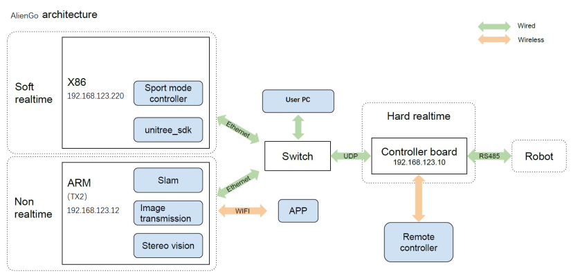
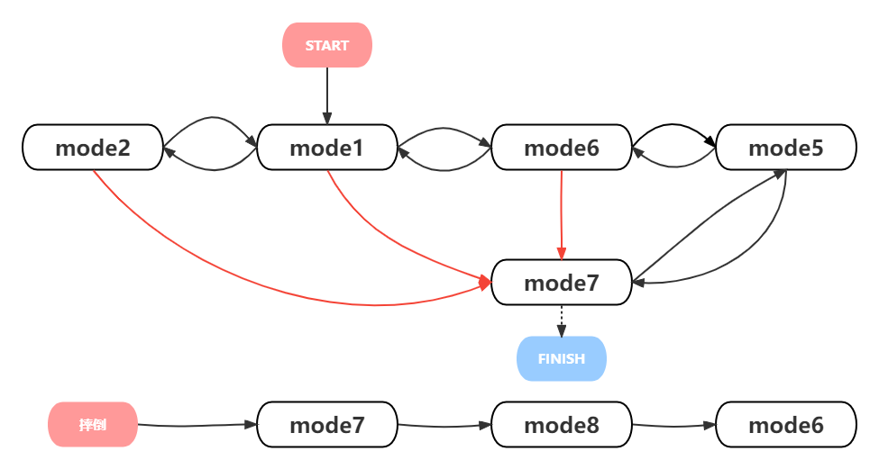
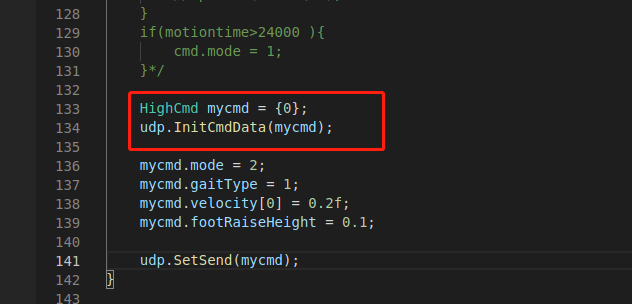
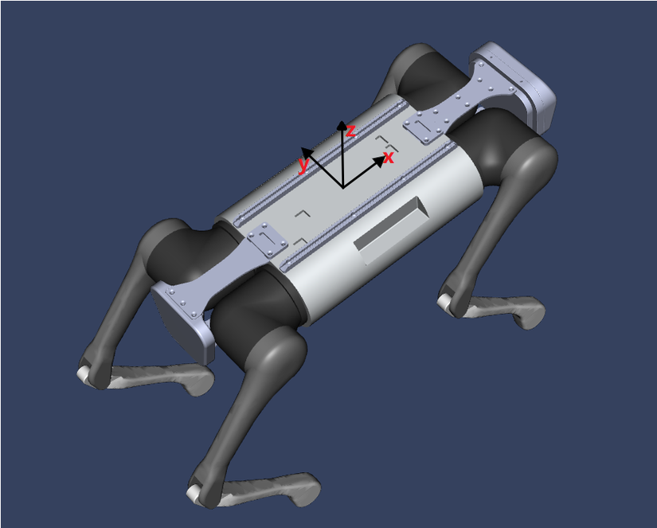
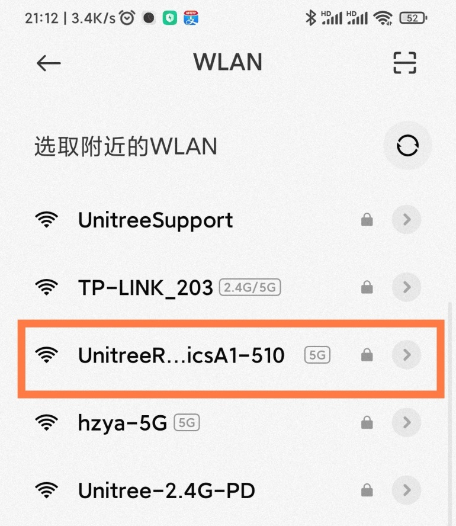
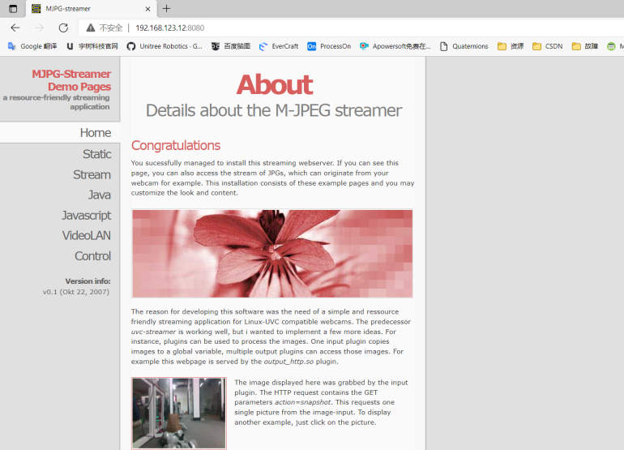
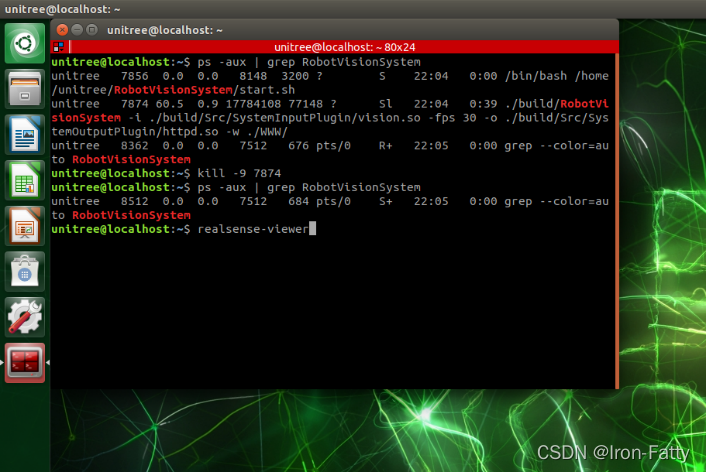
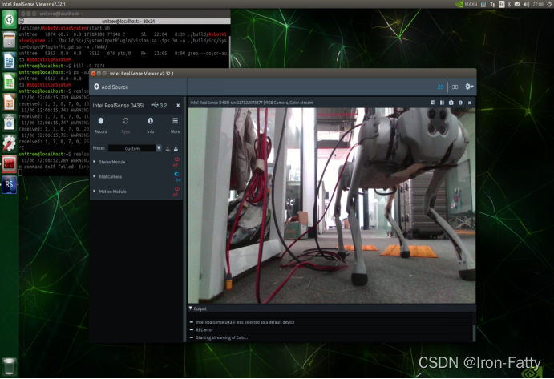
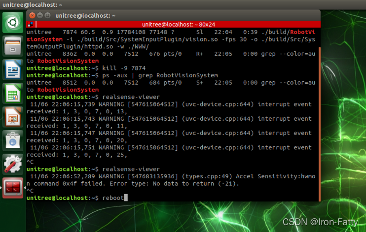
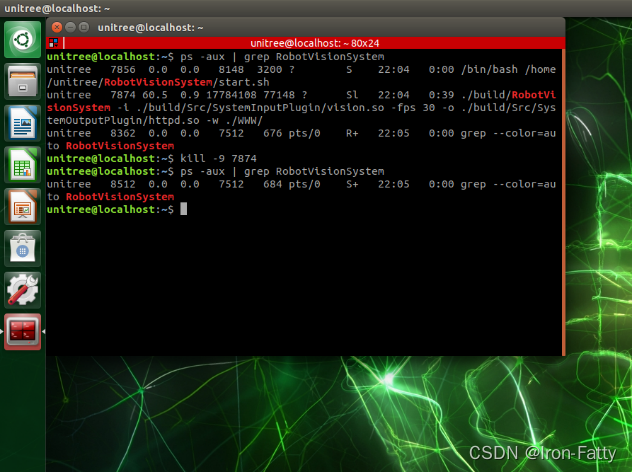

# AlienGo 
## 1. AlienGo system architecture diagram



Main control board: MCU (192.168.123.10)
Motion control motherboard: Mini PC (192.168.123.220)
Sensing motherboard: TX2 (192.168.123.12)

## 2. Precautions for AlienGo Development Using SDK

### 2.1 Motion program version query

Connect the HDMI, mouse and keyboard of miniPC, and open the terminal:

```
cd
./Legged_sport -v
```

### 2.2 SDK version selection and the running mode of the robot dog

According to the queried motion program version, select the corresponding sdk:

1. If the motion program ≤ 1.0.11, then:
Robot dog operating mode: **normal mode** (the robot dog stands up and is in normal mode after power-on self-inspection);
SDK package version: **v3.2** (unitree_legged_sdk that comes with minipc on the dog or downloaded from the  Unitree GitHub, download address: [unitreerobotics/unitree_legged_sdk at v3.2 (github.com)](https://github.com/unitreerobotics/unitree_legged_sdk/tree/v3.2);
ROS support: support unitree_ros and unitree_ros_to_real, unitree_ros_to_real version is v3.2.1, download address: [unitreerobotics/unitree_ros_to_real at v3.2.1 (github.com)](https://github.com/unitreerobotics/unitree_ros_to_real/tree/v3.2.1).

2. If the motion program > 1.0.11, then:
Robot dog running mode: **sports mode** (the robot dog needs to switch to sports mode after power-on self-inspection, support switching through SDK, reference example: example_start_aliengo_sport.cpp);
SDK package version: contact Unitree technical support to obtain, generally named after the version number of the motion program;
ROS support: Packaged ROS packages are no longer provided, and customers can call the SDK implementation in ROS by themselves.

### 2.3 SDK required dependencies and running permissions

Please read the **Readme file** carefully before use, which contains the dependencies required by the SDK and the method of compiling and running.
● depend on
See the readme file for the required dependencies;
If the system is on the dog, the required dependencies have been installed and can be compiled and used directly;
If you are on your own PC, you generally need to install LCM, and there are download links and installation methods in the readme.
● compile
See the readme file for the compilation method;
Before compiling, you need to modify the library file called in the CmakeList file, and choose amd64 or arm64 according to your own platform.
● run
See the readme file for usage;
To run the compiled file, sudo permission is required to lock the memory.

## 3. AlienGo SDK High Level Interfaces

### 3.1 AlienGo SDK HighCmd

Applicable to motion programs & SDKs of version 1.0.17 and later.

#### 3.1.1 Useful control command in HighCmd struct for custom development

#### 3.1.2 AlienGo SDK HighCmd mode

state machine:




Notice:
1. mode5 (low profile lock) is only a transitional state, please do not keep this state for a long time.
2. mode7 (damping mode) is equivalent to L2+B, soft emergency stop.
3. Crouching process: mode2 -> mode1 -> mode6 -> mode5 -> mode7.
4. Stand up process: mode7 -> mode5 -> mode6.
5. Unlock walking: mode6 -> mode1 -> mode2.
6. Fall recovery: fall -> mode7 -> mode8.
7. When no command is given to the robot dog, the robot dog can be in mode0 (idle state).

#### 3.1.3 HighCmd variable initialization



The HighCmd structure variable needs to be initialized after applying for the variable (mainly the flag bit variable initialization), which can be realized by using the udp.InitCmdData(&HighCmd highcmd) function. It can be used normally after initialization.

### 3.2 AlienGo SDK HighState

Applicable to motion programs & SDKs of version 1.0.17 and later.

#### 3.2.1 Useful state feedback in **HighState** struct for custom development

#### 3.2.2 AlienGo SDK HighState IMU

#### 3.2.3 Coordinate system



fuselage coordinate system
The sports mode is started and established, with the center of the fuselage as the origin, the forward direction is the x direction, the left direction is the y direction, and the vertical upward direction is the z direction.
World coordinate system (inertial system)
The sports mode is started and established, with the center of the fuselage as the origin, the forward direction is the x direction, the left direction is the y direction, and the vertical upward direction is the z direction.
initial coordinate system
It is established when the IMU is powered on. The Z axis of the IMU is in the direction of gravity, and the XY is based on the time when the power is turned on. The obtained angular velocity is in the initial coordinate system.

## 4. AlienGo RobotVisionSyetem Video Streaming Server

When using the robot dog, sometimes it is necessary to display the real-time picture of the dog on the big screen, which can be realized by using the web service provided by the built-in vision program.

1. Wait 3-5 minutes after turning on AlienGo, then connect to the hotspot sent by the robot dog



2. After configuring the network settings of the App, you can view the camera information in the App

3. The image information can also be obtained through the browser, the link is http://TX2 IP:8080 (the default address is http://192.168.123.12:8080)



4. The direct default video stream address is:
http://192.168.123.12:8080/?action=stream

PS:
This service uses the webpage service that comes with the visual service, so you must first ensure that the built-in visual program is in normal use.

Secondly, any IP address of the perception board (NX or Raspberry Pi for A1, TX2 for AlienGo) can be accessed. Therefore, the sensor board can be connected to other wireless networks, and the computer or large screen that needs to display the video stream is also connected to the same network, which can be realized by using the above method. The stream address is the address of the sensor board under this network.

## 5. AlienGo calls the camera through realsense-viewer

When using the robot dog, sometimes it is necessary to view the calling camera through the system on the TX2, which can be viewed through the realsense-viewer provided by realsense. However, the vision program that comes with the robot dog will start up and occupy the camera, so you need to kill this process first.

1. Open the terminal, query the process number of the visual application through the ps command, and kill the process through the kill command

```
ps -aux | grep RobotVisionSystem
kill -9 7874   #The process number queried here is 7874, which needs to be changed to the actual queried one
```


2. Enter the realsense-viewer command to call the camera program

```
realsense-viewer
```





3. After using, return to the terminal window, Ctrl+C to end the program



4. Restart the robot dog to restore

PS:
If the self-developed vision program needs to call the camera, you can cancel the self-starting of the built-in vision program:

```
cd
cd RobotVisionSystem
gedit start.sh
```

In the text editor that pops up, just comment out the last line of the startup script.

## 6. AlienGo Realsense SDK usage example

The robot dog perceives the Realsense environment that has been configured on the motherboard, and can use the D435i camera through librealsense.

### 6.1 Camera Information

● Camera model: Intel RealSense D435
● Official website description: https://www.intelrealsense.com/zh-hans/depth-camera-d435/
● DataSheet: https://www.intelrealsense.com/wp-content/uploads/2020/06/Intel-RealSense-D400-Series-Datasheet-June-2020.pdf
● Development sdk: https://github.com/IntelRealSense

### 6.2 Close the built-in program occupation

Similarly, the vision program that comes with the robot dog will start up and occupy the camera, so you need to kill this process first.

Open the terminal, query the process number of the visual application through the ps command, and kill the process through the kill command

```
ps -aux | grep RobotVisionSystem
kill -9 7874   #The process number queried here is 7874, which needs to be changed to the actual queried one
```



