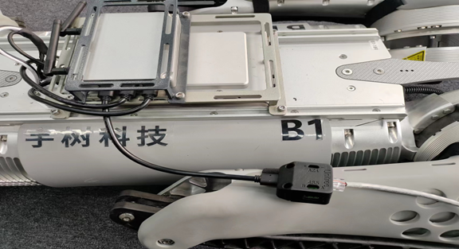

# 1. Networking through an external USB network card
> Connect to an external USB wireless network card or USB wired network card through the USB port of the board to network

​                         


# 2.Modify the network configuration to connect to the Internet through the network port of the dog

1. Connect the computer to the robot dog WiFi (you can choose Unitree_B1-dog number-2.4G or Unitree_B1-dog number-5G)
2. Win key + R, open the terminal，press:
```
ssh unitree@192.168.123.25
//Take the connection to the NX board on the head of the robot dog as an example
//password 123
```
3. vim the following ‘interfaces' file
          
4. When adding configuration information, pay attention to the name of the wired port. Here we take eth0 as an example. Please edit according to the actual situation. The added configuration information is a dynamically assigned (DHCP) address.Press the I key to enter the edit mode, enter the code

```
auto eth0:1
iface eth0:1 inet dhcp
```
   Then press the ESC key to exit the editing mode, and then enter: wq to save

5. You can use the cat command to view the change result (the code in the red box is the code we just entered)
                      

6. Then enter sudo reboot to restart
7.  From then on, you should be able to access the Internet when the network cable is plugged into the network port. You can ping the gateway or test www.baidu.com
8.  When you no longer use this network, edit the network configuration file /etc/network/interfaces again, comment out the modified part with # or delete it to restore the default, and restart with sudo reboot.

