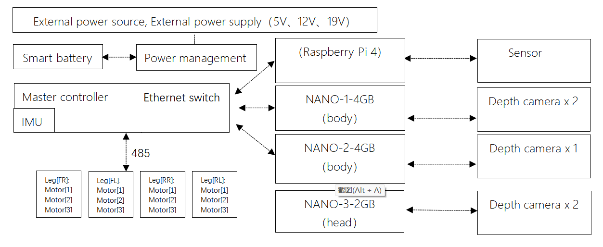
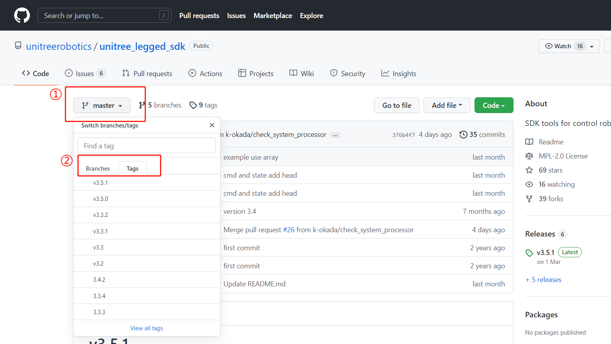
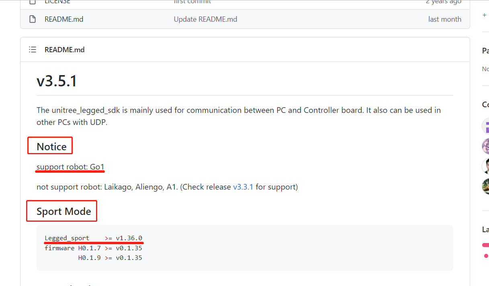
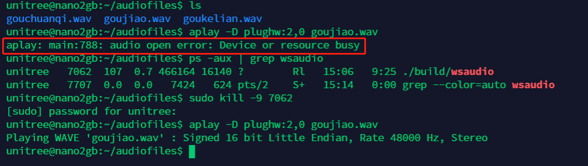
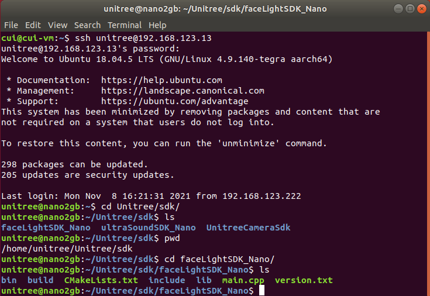
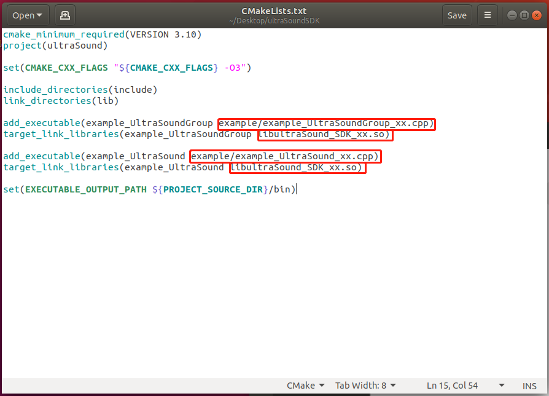
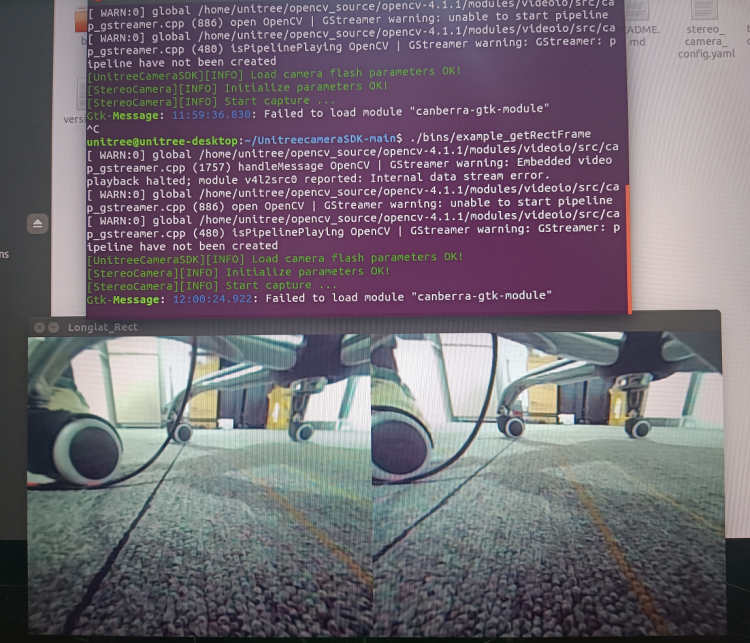
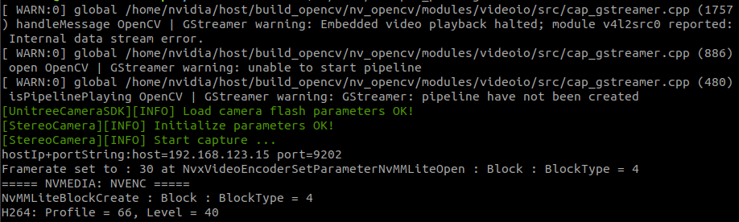
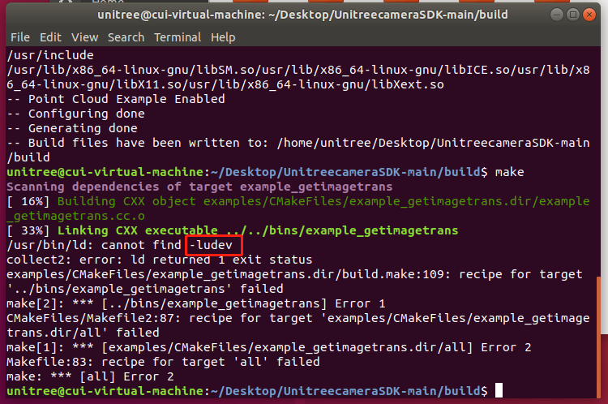

# Go1-Edu

# 1. Go1 system architecture diagram

GO1  uses  a new hardware architecture and control  system  , control  system  as follows:



Main control board: MCU (192.168.123.10)
Motion Control Board: RasPi 4B (192.168.123.161)
Sensing motherboard: Nano (head, 192.168.123.13), Nano (body, 192.168.123.14), Nano or NX (body, 192.168.123.15)


## 2. Precautions for Go1 development using SDK

### 2.1 Robot motion program version query

1. Connect to the hotspot of the robot dog (the factory-set WiFi name is Goxxxxxxxx, the password is 00000000)
2. ssh to the sports host (address 192.168.12.1, user name pi, password 123)

```
ssh pi@192.168.12.1
123
```

3. Query the version of the  robot exercise program

```
cd Unitree/autostart/02sportMode
./bin/Legged_sport -v   
```


### 2.2 SDK version selection and the running mode of the robot dog

According to the queried version of the motion program, we click on the link to select the corresponding version of the sdk:

https://github.com/unitreerobotics/unitree_legged_sdk





Please note that SDK version ≥ 3.4 is applicable for Go1

### 2.3 The dependencies required by the SDK and its running permissions

Please read the Readme file carefully before use, which contains the dependencies required by the SDK and the method of compiling and running.
● depend on
See the readme file for the required dependencies;
If the required dependencies have been installed on the robot dog, it can be compiled and used directly;
If you are on your own PC, you generally need to install LCM, and there are download links and installation methods in the readme.
● compile
See the readme file for the compilation method;
Before compiling, you need to modify the library file called in the CmakeList file, and choose amd64 or arm64 according to your own platform.
● run
See the readme file for usage;
To run the compiled file, sudo permission is required to lock the memory

## 3. Go1 SDK HighLevel Interfaces

### 3.1 Go1 SDK HighCmd

The following content is applicable to Go1 SDK version 3.5.1, other versions of Go1 SDK and A1 sports mode SDK can also be referred to.

#### 3.1.1  Main control commands in the HighCmd structure


| uint8_t  mode |                                                              |
| ------------- | ------------------------------------------------------------ |
| 0             | Idle.                                                        |
| 1             | Standing, in force control.                                  |
| 2             | Walking, following target velocity.                          |
| 3             | Walking, following target position, reserve for future release. |
| 4             | Walking, following a given path, reserve for future release. |
| 5             | Stand down, in position control.                             |
| 6             | Stand up, in position control.                               |
| 7             | Damping mode, all motors.                                    |
| 8             | Recovery mode.                                               |
| 9             | backflip                                                     |
| 10            | jumpYaw                                                      |
| 11            | straightHand                                                 |
| 12            | dance1                                                       |
| 13            | dance2                                                       |

| uint8_t  **gaitType** |                  |
| --------------------- | ---------------- |
| 0                     | Idle.            |
| 1                     | Trot walking.    |
| 2                     | Trot running.    |
| 3                     | Stairs climbing. |
| 4                     | Trot obstacle.   |

| uint8_t  **speedLevel**                             |                       |
| --------------------------------------------------- | --------------------- |
| 0                                                   | Default low speed.    |
| 1                                                   | Default medium speed. |
| 2                                                   | Default high speed.   |
| SpeedLevel setting is now only used for **mode 3**. |                       |


| float**footRaiseHeight**(unit: m)    | Swing foot height adjustment from default swing height.delta valuedefault: 0.08m |
| ------------------------------------ | ------------------------------------------------------------ |
| float**bodyHeight**(unit: m)         | Body height adjustment from default body height.delta valuedefault: 0.28m |
| float**position**[2](unit: m)        | Desired x and y position in the inertial frame, which is established at the beginning instance of the sport mode. Position setting is used in **mode 3** as target position. |
| float**euler**[3](unit: rad)         | Desired yaw-pitch-roll Euler angle, with euler[0] = Roll,euler[1] = Pitch,euler[2] = Yaw.RPY setting can be used in **mode 1** as target orientation.Yaw setting can be used in **mode 3** as target yaw angle. |
| float **v****elocity**[2](unit: m/s) | Desired robot forward speed and side speed in the body frame. Velocity setting is used in **mode 2** as target linear velocity. |
| float **y****awSpeed**(unit: rad/s)  | Desired rotational yaw speed. YawSpeed setting is used in **mode 2** as target rotational speed. |


#### 3.1.2  Go1 SDK HighCmd mode

| **mode** | **state**                                                    | **controlled by**                              | **previous mode** |
| -------- | ------------------------------------------------------------ | ---------------------------------------------- | ----------------- |
| mode 0   | Idle.                                                        | none                                           | all mode          |
| mode 1   | Standing, in force control.                                  | euler, bodyHeight                              | mode 2 6          |
| mode 2   | Walking, following target velocity.                          | velocity+yawSpeed, bodyHeight, footRaiseHeight | mode 1            |
| mode 3   | Walking, following target position.                          | reserve for future release                     | mode 1            |
| mode 4   | Walking, following a given path, reserve for future release. | reserve for future release                     | mode 1            |
| mode 5   | Stand down, in position control.                             | none                                           | mode 6 7          |
| mode 6   | Stand up, in position control.                               | none                                           | mode 1 5          |
| mode 7   | Damping mode, all motors.                                    | none                                           | all mode          |
| mode 8   | Recovery mode.                                               | none                                           | mode 7            |

Notice:
1. mode5 (low profile lock) is only a transitional state, please do not keep this state for a long time.
2. mode7 (damping mode) is equivalent to L2+B, soft emergency stop.
3. Crouching process: mode2 -> mode1 -> mode6 -> mode5 -> mode7.
4. Stand up process: mode7 -> mode5 -> mode6.
5. Unlock walking: mode6 -> mode1 -> mode2.
6. Fall recovery: fall -> mode7 -> mode8.
7. When no command is given to the robot dog, the robot dog can be in mode0 (idle state).

#### 3.1.3 HighCmd variable initialization


The HighCmd structure variable needs to be initialized after applying for the variable (mainly the flag bit variable initialization), which can be realized by using the udp.InitCmdData(&HighCmd highcmd) function. It can be used normally after initialization.

### 3.2 Go1 SDK HighState

#### 3.2.1 Effective state feedback in the HighState structure

| head                                        | 包头                                                         |
| ------------------------------------------- | ------------------------------------------------------------ |
| levelFlag                                   | 高层模式、底层模式标志位；0x00为高层，0xff为底层             |
| frameReserve                                | 保留位                                                       |
| SN                                          | SN码                                                         |
| version                                     | 版本信息                                                     |
| bandWidth                                   | 保留位                                                       |
| IMU **imu**                                 | 惯导信息，参考2.2 Go1 SDK HighState IMU                      |
| MotorState**motorState**[20]                | 电机数据，20个MotorState结构体数组，其中前12个有效，各个电机的编号可以参考quadruped.hMotorState结构体参考2.4 MotorState |
| int16_t **footForce**[4]                    | 足端传感器数值，触地检测。这个值是飘的，每个气囊的值不一样，需要实际测试，通常是通过变化量来检测是否触地。 |
| int16_t **footForceEst**[4]                 | 估计的足端力，单位应该是N                                    |
| uint8_t **mode**                            | 参考1.1 HighCmd中mode的注释                                  |
| float **progress**                          | 保留位                                                       |
| uint8_t **gaitType**                        | 参考1.1 HighCmd中gaitType的注释                              |
| float**footRaiseHeight**(unit: m)           | 行走时的抬腿高度，默认0.08m                                  |
| float**bodyHeight**(unit: m)                | 机身高度，默认0.28m                                          |
| float **position**[3](unit: m)              | 机器人的位置坐标反馈，通过机器人在惯性系（世界坐标系）中里程计的数据获得的位置坐标，会漂移position[0] = xposition[1] = yposition[2] = z |
| float **velocity**[3](unit: m/s)            | 机器人在各个方向的速度反馈velocity[0] = forwardSpeedvelocity[1] = sideSpeedvelocity[2] = updownSpeed |
| float **yawSpeed**(unit: rad/s)             | 机器人的旋转速度                                             |
| float **rangeObstacle**[4]                  | 避障数据                                                     |
| Cartesian **footPosition2Body**[4](unit: m) | 足端相对于身体的位置（机身坐标系）footPosition2Body[0] = 右前腿足端的位置footPosition2Body[1] = 左前腿足端的位置footPosition2Body[2] = 右后腿足端的位置footPosition2Body[3] = 左后腿足端的位置 |
| Cartesian **footSpeed2Body**[4](unit: m/s)  | 足端相对于身体的速度（机身坐标系）footSpeed2Body[0] = 右前腿足端的速度footSpeed2Body[1] = 左前腿足端的速度footSpeed2Body[2] = 右后腿足端的速度footSpeed2Body[3] = 左后腿足端的速度 |
| uint8_t **wirelessRemote**[40]              | 遥控器键值的反馈，可参考提供的手柄例程源码                   |
| reserve                                     | 保留位                                                       |
| crc                                         | 校验位                                                       |

#### 3.2.2 Go1 SDK HighState IMU

| float quaternion[4]                | 归一化的四元数quaternion[0] = wquaternion[1] = xquaternion[2] = yquaternion[3] = z |
| ---------------------------------- | ------------------------------------------------------------ |
| float gyroscope[3](unit: rad/s)    | 陀螺仪，角速度，原始数据gyroscope[0] = xgyroscope[1] = ygyroscope[2] = z |
| float accelerometer[3](unit: m/s²) | 加速度计，加速度，原始数据accelerometer[0] = xaccelerometer[1] = yaccelerometer[2] = z |
| float rpy[3](unit: rad)            | 欧拉角rpy[0] = Rollrpy[1] = Pitchrpy[2] = Yaw                |
| int8_t temperature                 | IMU温度                                                      |

#### 3.2.3 Coordinate System

1. Fuselage coordinate system
    The sports mode is started and established, with the center of the fuselage as the origin, the forward direction is the x direction, the left direction is the y direction, and the vertical upward direction is the z direction.

2. World coordinate system (inertial system)
    The sports mode is started and established, with the center of the fuselage as the origin, the forward direction is the x direction, the left direction is the y direction, and the vertical upward direction is the z direction.

3. Initial coordinate system
    It is established when the IMU is powered on. The Z axis of the IMU is in the direction of gravity, and the XY is based on the time when the power is turned on. The obtained angular velocity is in the initial coordinate system.

#### 3.2.4 MotorState

| uint8_t **mode**                | The current working mode of the motor                        |
| ------------------------------- | ------------------------------------------------------------ |
| float **q**(unit: rad)          | The current angle of the motor                               |
| float **dq**(unit: rad/s)       | The current angular velocity of the motor                    |
| float **ddq**(unit: rad/s²)     | The current angular acceleration of the motor                |
| float **tauEst**(unit: N·m)     | The current estimated output torque of the motor             |
| float **q_raw**(unit: rad)      | The raw value of the current angle of the motor              |
| float **dq_raw**(unit: rad/s)   | The raw value of the current angular velocity of the motor   |
| float **ddq_raw**(unit: rad/s²) | The raw value of the current angular acceleration of the motor |
| int8_t **temperature**          | Motor temperature, but lag due to slow temperature conduction |

## 4. Go1 head speaker to play audio

### 4.1 Go1 head speaker audio playback method

The head of Go1 integrates a 3W speaker, which we can use to play audio files to make the robot dog make sound.

1. Connect your own computer to the 123 segment network of Go1.

   ```
   ping 192.168.123.13
   ```
   
   
   
2. Transfer the generated wav audio files to the nano on the head (address 192.168.123.13), and create a new folder for audio files.

3. Check the sound card id and channel id (usually 2, 0) of the USB Audio Device.

   ```
   aplay -l
   ```

   

4. Play audio files by aplay command (aplay -D plughw:2,0 xxx.wav)

  ```
  aplay -D plughw:2,0 xxx.wav
  ```

  Adjust volume: (amixer -c 2 set Speaker 37) 37 corresponds to 100% volume, 0 corresponds to 0% volume.

  ```
  amixer -c 2 set Speaker 37
  amixer -c 2 set Speaker 18
  ```

  If you use aplay to prompt an error audio open error: Device or resource busy :
  This situation is caused by the built-in program wsaudio occupying the speaker. We can check the process number and kill it before trying again.

  ```
  ps -aux | grep wsaudio
  sudo kill -9 PID
  ```

  

  ## 5. Development and use of Go1 head LED light bar

  On both sides of the head of Go1, there are two light strips, and we also provide corresponding sdk for developers to use.

  ### 5.1 Hardware and SDK

  The hardware of the light strip is composed of 12 LED lamp beads, which are distributed on both sides of the head, and the hardware is connected to the Nano on the head. For the address definition of these 12 LEDs, we define them as 0-11 in the order of facing the dog head, from top to bottom, and from left to right, as shown in the figure below.

  

  

The SDK package is located in the folder named faceLightSDK_Nano under the /home/unitree/Unitree/sdk/ directory of the head Nano (192.168.123.13).




The SDK package contains the following:
CMakeLists.txt --cmake file
include --header file folder
lib -- library file folder
main.cpp -- routine
version.txt --sdk version
bin -- the generated executable folder
build -- compile folder

### 4.2 Introduction to routines


The picture above is the code of the routine. Two programs are provided for testing. One is to use the same color for all lamp beads, and the other is to combine different colors of different lamp beads to form a new lighting effect.
It should be noted that we provide two control functions:
client.setAllLed(client.red); --All LEDs use the same color
client.setLedColor(i,client.red); --A lamp bead uses a certain color, and the value of i is the lamp bead address definition in the previous section
After setting the color, you need to send the function through the command to send the set color to the light strip to take effect:
client.sendCmd(); --Send command function to make the set color take effect

### 4.3 Operation of SDK

First remote login to the head Nano

```
ssh unitree@192.168.123.13
123
```

Build

```
cd Unitree/sdk/faceLightSDK_Nano
mkdir build
cd build
cmake ..
make
```

Usage

```
./../bin/faceLightClient
```

### 4.4 Use the SDK on other boards or your own computer

The light strip SDK uses UDP communication method, which is convenient to control the head LED on other boards through the network. The communication part of the SDK has been written, and the address of the Nano in the head has also been solidified in it, so we don’t need to deal with the programming of communication, we just need to ensure that the board or computer can ping the Nano in the head (192.168.123.13). The method of use is the same as the direct use on the head Nano.
Instructions:

1. Set the address of the board or your own computer to the 123 network segment, and you can ping the head Nano (192.168.123.13)
2. Copy the SDK folder to your own board or computer
3. According to your own computer platform, modify the library file referenced in the cmake file
4. Compile and run

## 5. Development and use of Go1 ultrasonic module

The head and body of Go1-Edu are distributed with 3 groups of ultrasonic modules, which can be developed and used with the programs we provide.

Ultrasonic sensors only exist in the old version of go1, the new version of go1 do not contain ultrasonic sensors.

As the ultrasonic module feedback distance and obstacle avoidance effect in general, the subsequent hardware version, will eliminate the ultrasonic module.

### 5.1 Hardware

3 groups of ultrasonic modules are distributed in the front face, left and right sides of the fuselage. Hardware, forward ultrasound connected to the head Nano (192.168.123.13) on ttyTHS1, ultrasound on both sides of the body connected to the RasPi (192.168.123.161) on ttyAMA0, software design reserved for the backward ultrasound, the actual hardware is not installed.

ttyTHS1, ttyAMA0 are the serial ports on Nano and RasPi respectively, which have been configured on the system, do not modify the system configuration when using, so as not to make the device unusable.

### 5.2 SDK

There are two ways to use ultrasound on Go1, one is to use the lcm topic provided by Unitree to receive all the ultrasound data, and the other is to read the serial data directly. Unitree prefers to use the former.

#### 5.2.1  Receive all ultrasound data using the lcm topic provided by Unitree

The path of the sample program provided in this way on the dog is ~/Unitree/autostart/utrack/ultrasonic_listener_example/, which can be compiled and run directly on the RasPi. You can also directly download the following program package and run it on RasPi.

[ultrasonic_listener_example.zip - Google 云端硬盘](https://drive.google.com/file/d/1I-wDsDtEYdhXvw7Eze3kfBDwjpPhEv_x/view)

- Introduction

Some details about the format of ultrasonic data is here:

- The ultrasonic lcm topic is published only at the `RasperryPi` in `Go1` Robot.
- The valid distance range is **(0,2.0)** in meters.
  The publisher returns **2.0** when the sound wave is emitted but lost for the corresponding probe.
  The publisher returns **10.0 **for the corresponding probe when there is no update for the corresponding probe.
- The LCM topic is published at constant frequency, which is around **100Hz**
  The update frequency for each single probe is around  **30Hz**

The LCM topic to listen ultrasonic data is:

- "/unitree/ultrasonic"

The LCM message file is:

- "include/lcm_msgs/ultrasonic_data.lcm"

  compile

  ```
  mkdir build
  cd build
  cmake ..
  make
  ```

  use

  ```
  cd bin
  ./ultrasonic_listener_lcm
  ```

  

#### 5.2.2 Read serial data directly

This method is to use the serial port of the board to directly read the information of the ultrasonic module. Unitree provides the sdk for use. The sdk is located at ~/Unitree/sdk/ultraSoundSDK_RasPi (the one on Nano13 is also in the corresponding position). After the program starts, it will occupy the serial port, so before using this method, you need to kill the program that occupies the device.

[ultraSoundSDK.zip - Google 云端硬盘](https://drive.google.com/file/d/1fKcSBSeYF_AEUrl46B70JMfksXoXhwac/view)

This package, above, is the sorted sdk, and it is recommended to use this one. The following introduction to the use of this version is based on this version, similar to the version that comes with the dog.

The SDK includes the following:
example --example program
include -- header file
lib-- library file
CmakeLists.txt-- cmake file
readme.md - ReadMe
Among them, the following sample programs are provided in the example:
example_UltraSound_Nano.cpp -- head Nano uses UltraSound method to get data
example_UltraSound_RasPi.cpp -- The body RasPi uses the UltraSound method to obtain data
example_UltraSoundGroup_Nano.cpp -- head Nano uses UltraSoundGroup method to get data
example_UltraSoundGroup_RasPi.cpp -- body RasPi uses the UltraSoundGroup method to obtain data

As you can see from the sample program, the SDK provides 2 methods to obtain ultrasonic data, UltraSound and UltraSoundGroup.

UltraSound is to get the data one by one according to the device number, device number 0, 1, 2, 3 represent the forward, left, right and backward ultrasonic waves respectively. As mentioned before, the software is designed to reserve the backward ultrasound, in reality there is no backward ultrasound device, so be careful when using it.

UltraSoundGroup is a vector to do a package, the user can choose their own.

Before use, you need to put the SDK package on the appropriate board!Local use only.

- Unlock hardware

```
#Inquire
ps -aux | grep g1_ultrasonic
#kill
ps -aux | grep g1_ultrasonic | awk '{print $2}' | xargs kill -9
```

- Modify the CMakeLists.txt file



Replace xx in the CMakeLists.txt file with Nano or RasPi according to the actual situation.

● compile

```
mkdir build
cd build
cmake ..
make
```

● use

```
cd bin
./example_UltraSound
./example_UltraSoundGroup
```

## 6. Development and use of Go1 binocular fisheye camera

The head and body of Go1-Edu are distributed with 5 sets of binocular fisheye cameras, and we provide the corresponding UnitreeCameraSDK for developers to use.

### 6.1 Hardware


The 5 groups of cameras are distributed on the front face, chin, left and right sides of the fuselage and abdomen. In terms of hardware, the front camera and chin camera are connected to the Nano on the head (192.168.123.13), the cameras on both sides of the fuselage are connected to the Nano (192.168.123.14), and the belly camera is connected to the main Nano or NX (192.168 .123.15) on. 

In the system of each motherboard, the device ID (dev ID) is assigned to the camera:
Head Nano (192.168.123.13), front face camera dev ID=1, chin camera dev ID=0;
Body Nano (192.168.123.14), left camera dev ID=0, right camera dev ID=1;
The main body is Nano (192.168.123.15), and the belly camera dev ID=0.

In order to facilitate the use of the receiving program, we define a port (Port ID) for each camera:
Front camera Port ID=9201, Chin camera Port ID=9202, Left camera Port ID=9203, Right camera Port ID=9204, Belly camera Port ID=9205.

Above, the following table:

| Nano                       | dev ID | Port ID | 相机位置 |
| -------------------------- | ------ | ------- | -------- |
| 头部Nano（192.168.123.13） | 1      | 9201    | 前方相机 |
| 头部Nano（192.168.123.13） | 0      | 9202    | 下巴相机 |
| 机身Nano（192.168.123.14） | 0      | 9203    | 左侧相机 |
| 机身Nano（192.168.123.14） | 1      | 9204    | 右侧相机 |
| 机身Nano（192.168.123.15） | 0      | 9205    | 腹部相机 |

Camera hardware parameters

| **RGB frame resolution：** | 1856x800（stereo）           |
| -------------------------- | ---------------------------- |
| RGB frame rate：           | 30fps                        |
| RGB sensor technology：    | Global Shutter               |
| RGB sensor FOV：           | 222°                         |
| Depth technology：         | Stereoscopic                 |
| Effective depth range：    | 10cm~85cm                    |
| Depth Field of View：      | ＜180°                       |
| Depth output resolution：  | adjustable（default464x400） |
| Depth frame rate：         | ≤30fps                       |

### 6.2 SDK

The camera SDK is hung on the Unitree GitHub warehouse, and can be downloaded and used by itself.

[unitreerobotics/UnitreecameraSDK: Unitree GO1 camera SDK (github.com)](https://github.com/unitreerobotics/UnitreecameraSDK) 

The camera SDK provides color and depth video streams, as well as internal calibration information, and also provides point clouds and depth images aligned with color images.

The SDK includes the following:
doc - documentation
examples -- example programs
include -- header file
lib-- library file
CmakeLists.txt-- cmake file
stereo_camera_config.yaml-- point cloud image, depth image reading configuration file
trans_rect_config.yaml -- transmission configuration file
Among them, the following sample programs are provided in examples:
example_getCalibParamsFile.cc -- get camera calibration parameters
example_getDepthFrame.cc -- get camera depth frame
example_getPointCloud.cc -- get camera point cloud image
example_getRawFrame.cc -- get raw camera image
example_getRectFrame.cc -- Get the image processed by the camera
example_getimagetrans.cc -- receive an image transmitted from the network
example_putImagetrans.cc -- send an image over the network
example_share.cc -- shared memory code routines, not open to users
Among them, the first five call the camera locally, just compile and run directly; the two transmission samples, one for sending and one for receiving, need to be run separately.

### 6.3 SDK usage example

Before using the SDK, you need to kill the built-in program that calls the camera in order to successfully obtain images. There are 4 programs related to the camera, point_cloud_node, mqttControlNode, live_human_pose, rosnode, which are used for point cloud images, transmission, human body recognition, etc., you can use the ps -aux command to query the status, kill these processes before use to release the camera occupation , Release computing power.

```
ps -aux | grep point_cloud_node
ps -aux | grep mqttControlNode
ps -aux | grep live_human_pose
ps -aux | grep rosnode
```

```
ps -aux | grep point_cloud_node | awk '{print $2}' | xargs kill -9
ps -aux | grep mqttControlNode | awk '{print $2}' | xargs kill -9
ps -aux | grep live_human_pose | awk '{print $2}' | xargs kill -9
ps -aux | grep rosnode | awk '{print $2}' | xargs kill -9
```

In order to facilitate everyone's understanding, we take several ways to obtain images as examples.

#### 6.3.1 The internal board obtains the local camera image of the board

This section takes 14 boards as an example to obtain the corrected image from the right camera. 14 boards need to be connected to devices such as HDMI monitors, mice and keyboards, and all operations are performed on the boards.

##### 6.3.1.1 download camera sdk

Download the UnitreecameraSDK by yourself, and put it on the board connected to the camera.

[unitreerobotics/UnitreecameraSDK: Unitree GO1 camera SDK (github.com)](https://github.com/unitreerobotics/UnitreecameraSDK) 

If the board is connected to the Internet, you can use the git command to download the latest camera sdk.

```
git clone https://github.com/unitreerobotics/UnitreecameraSDK.git
```

##### 6.3.1.2 Stop the camera-related processes that come with the board

```
ps -aux | grep point_cloud_node | awk '{print $2}' | xargs kill -9
ps -aux | grep mqttControlNode | awk '{print $2}' | xargs kill -9
ps -aux | grep live_human_pose | awk '{print $2}' | xargs kill -9
ps -aux | grep rosnode | awk '{print $2}' | xargs kill -9
```

As mentioned at the beginning of this section, we need to kill point_cloud_node, mqttControlNode, live_human_pose, rosnode processes (not all processes exist, for example, live_human_pose only exists on the main Nano). After killing, you can use the command to query the process, and then confirm whether the process is successfully killed.

##### 6.3.1.3 Compile and run example_getRectFrame

- Build

```
cd UnitreecameraSDK
mkdir build
cd build
cmake ..
make
```

- Run

After the compilation is completed, a bins folder will be generated under the UnitreecameraSDK directory, and the sending program will be run.

```
cd ..
./bins/example_getRectFrame
```

Note: Do not cd to bins to run, this will lack dependencies

The operation is successful as shown in the figure below



#### 6.3.2 Image transmission between internal boards

This section takes 15 boards to acquire 13 boards' forward camera images as an example. The 15 board needs to be connected to devices such as an HDMI monitor, mouse and keyboard, and all operations are performed on the 15 board.

##### 6.3.2.1 Download camera sdk

Download the UnitreecameraSDK by yourself, and put it on the required board.
If the board is connected to the Internet, you can use the git command to download the latest camera sdk.

```
git clone https://github.com/unitreerobotics/UnitreecameraSDK.git
```

##### 6.3.2.2 Send camera sdk to head Nano

Since the head Nano does not provide HDMI and USB for customers to use, we can use the scp tool to send the SDK folder to the head Nano.

```
scp -r UnitreecameraSDK unitree@192.168.123.13:/home/unitree/
```

##### 6.3.2.3 Remote connection head Nano

```
ssh unitree@192.168.123.13
password:123
```

##### 6.3.2.4 Stop the camera-related processes that come with the Nano on the head

```
ps -aux | grep point_cloud_node | awk '{print $2}' | xargs kill -9
ps -aux | grep mqttControlNode | awk '{print $2}' | xargs kill -9
ps -aux | grep live_human_pose | awk '{print $2}' | xargs kill -9
ps -aux | grep rosnode | awk '{print $2}' | xargs kill -9
```

As mentioned at the beginning of this section, we need to kill point_cloud_node, mqttControlNode, live_human_pose, rosnode processes (not all processes exist, for example, live_human_pose only exists on the main Nano). After killing, you can use the command to query the process, and then confirm whether the process is successfully killed.

##### 6.3.2.5 Modify the transmission configuration parameter file trans_rect_config.yaml

```
cd UnitreecameraSDK
vim trans_rect_config.yaml
```

```
%YAML:1.0
---
# [pls dont change] The log level 
LogLevel: !!opencv-matrix
   rows: 1
   cols: 1
   dt: d
   data: [ 1. ]
# [pls dont change] The threshold is applied to detecd point cloud
Threshold: !!opencv-matrix
   rows: 1
   cols: 1
   dt: d
   data: [ 190. ]
#[pls dont change] it's a switch for a algorithm in the process of computing stereo disparity 
Algorithm: !!opencv-matrix
   rows: 1
   cols: 1
   dt: d
   data: [1. ]
#UDP address for image transfer   192.168.123.IpLastSegment
IpLastSegment: !!opencv-matrix
   rows: 1
   cols: 1
   dt: d
   data: [ 15. ]
#This place should be changed to the actual receiving IP
#########################################
#DeviceNode
DeviceNode: !!opencv-matrix
   rows: 1
   cols: 1
   dt: d
   data: [ 1. ]
#To change the device number to what is needed, you can refer to the above
#########################################
#fov (perspective 60~140) 
hFov: !!opencv-matrix
   rows: 1
   cols: 1
   dt: d
   data: [ 90. ]
#image size ([1856,800] or [928,400])
FrameSize: !!opencv-matrix
   rows: 1
   cols: 2
   dt: d
   data: [ 1856., 800. ]
#rectified frame size
RectifyFrameSize: !!opencv-matrix
   rows: 1
   cols: 2
   dt: d
   data: [ 928., 800. ]
#FrameRate, it gives the limitation for transmission rate(FPS)
FrameRate: !!opencv-matrix
   rows: 1
   cols: 1
   dt: d
   data: [ 3e+01 ]
#0 ori img - right  1 ori img - stereo  2 rect img - right  3 rect img - stereo   -1 不传图
Transmode: !!opencv-matrix
   rows: 1
   cols: 1
   dt: d
   data: [ 2. ] 
#The transmode here, 0 and 1 cannot be used, you need to set 2 or 3
#########################################
#Transmission rate(FPS) in the UDP transmitting process. <= FrameRate
Transrate: !!opencv-matrix
   rows: 1
   cols: 1
   dt: d
   data: [ 3e+01 ] 
# [pls dont change]  It's a switch in distortion process of fisheye camera. 1 represents “Longitude and latitude expansion of fisheye camera”;  2 represnets "Perspective distortion correction".
Depthmode: !!opencv-matrix
   rows: 1
   cols: 1
   dt: d
   data: [ 1. ] 
 # empty reserved IO
Reserved: !!opencv-matrix
   rows: 3
   cols: 3
   dt: d
```

##### 6.3.2.6 编译运行`example_putImagetrans`

- Build

  ```
cd UnitreecameraSDK
mkdir build
cd build
cmake ..
make
  
  ```

●Run
After the compilation is completed, a bins folder will be generated under the UnitreecameraSDK directory, and the sending program will be run.

```
cd ..
./bins/example_putImagetrans
```

Note: Do not run from cd to bins, this will lack dependencies
The successful operation is shown in the figure below:



Note: When we recompile and run the sending program, sometimes an error will be reported, which may be related to the fact that the sending process has not been killed.
At this time, you can kill the following program and try again.
ps -aux | grep send_image_client | awk '{print $2}' | xargs kill -9

##### 6.3.2.7 Compile and run example_getimagetrans on 15 boards

● Edit example_getimagetrans.cc

```
#include <opencv2/opencv.hpp>
#include <iostream>
int main(int argc,char** argv)
{
    std::string IpLastSegment = "15";//改为当前板卡的IP
    int cam = 1;//前方端口为1（9201）
```

- Build

```
cd UnitreecameraSDK
mkdir build
cd build
cmake ..
make
```

- Run

```
  cd ..
  ./bins/examples_getimagetrans
```

  Note: Do not run from cd to bins, this will lack dependencies
The program runs fine and we can see the acquired image:

Note:
If the sender has sent, but the program cannot receive, you can enter the following command in the terminal to test:
gst-launch-1.0 udpsrc port=9201 ! application/x-rtp, media=video, encoding-name=H264 ! rtph264depay ! h264parse ! omxh264dec ! videoconvert ! autovideosink

#### 6.3.3 The client PC obtains a single image from the camera in front of the head

This section takes the customer PC to obtain the image of the front-facing camera of the 13 boards through the network cable as an example.

##### 6.3.3.1 Configure client PC network

Connect the client PC and the robot dog through a network cable, and configure the PC wired network card.
The following is an example of configuring the local IP network segment, please follow the actual situation.

```
sudo ifconfig eth0 192.168.123.100/24
sudo ifconfig eth0 up
ifconfig
```

##### 6.3.3.2 Download camera sdk

Download the UnitreecameraSDK by yourself, and put it on the required board and PC.

[unitreerobotics/UnitreecameraSDK: Unitree GO1 camera SDK (github.com)](https://github.com/unitreerobotics/UnitreecameraSDK) 

If the board and PC are connected to the Internet, you can use the git command to download the latest camera sdk.

```
git clone https://github.com/unitreerobotics/UnitreecameraSDK.git
```

##### 6.3.3.3 Configure the head board to send images

Refer to sections 6.3.2.2 - 6.3.2.6, and will not repeat them here.

##### 6.3.3.4 Configure the environment dependencies of your own PC

1. Install gstremer dependencies

```
sudo apt update
sudo apt install -y libgstreamer1.0-dev libgstreamer-plugins-base1.0-dev libgstreamer-plugins-bad1.0-dev libgstreamer-plugins-good1.0-dev
sudo apt install -y gstreamer1.0-plugins-base gstreamer1.0-plugins-good gstreamer1.0-plugins-bad gstreamer1.0-plugins-ugly
sudo apt install -y gstreamer1.0-tools gstreamer1.0-libav
sudo apt install -y gstreamer1.0-doc gstreamer1.0-x gstreamer1.0-alsa gstreamer1.0-gl gstreamer1.0-gtk3 gstreamer1.0-qt5 gstreamer1.0-pulseaudio
```

If the installation fails, try over the wall or change the source.
To change the source, you can try the source of ustc.edu.cn.

2. Compile and install opencv4.1.1 from source code

  Download the source code of opencv4.1.1

  [相关软件环境库 - OneDrive (live.com)](https://onedrive.live.com/?authkey=!AAgd-2ZcuPDFM4E&cid=CDE1BA91EFBCF992&id=CDE1BA91EFBCF992!739&parId=CDE1BA91EFBCF992!738&o=OneUp)

  Unzip, compile and install

```
mkdir build
cd build
cmake -D OPENCV_GENERATE_PKGCONFIG=YES ..
make -j4
sudo make install
```

If an error is reported during compilation fatal error: Eigen/Core: No such file or directory
1. Manually install eigen3 (usually installed)
sudo apt install libeigen3-dev
2. This error is still reported after installation or after installation, you can modify the path of eigen in the source code
Go to the file ~/opencv-4.1.1/modules/core/include/opencv2/core/private.hpp, modify # include <Eigen/Core> to # include <eigen3/Eigen/Core>, and then recompile.

##### 6.3.3.5 Compile and run example_getimagetrans on your own PC

● Edit example_getimagetrans.cc

```
#include <opencv2/opencv.hpp>
#include <iostream>
int main(int argc,char** argv)
{
    std::string IpLastSegment = "100";//改为当前PC的IP
    int cam = 1;//前方端口为1（9201）
```

Note: If the PC is an AMD64 (X86) platform, you need to modify the decoder in the receiving program:
std::string udpstrBehindData = " ! application/x-rtp,media=video,encoding-name=H264 ! rtph264depay ! h264parse ! avdec_h264 ! videoconvert ! appsink";
If the PC is an ARM64 platform, just keep the original decoder:
std::string udpstrBehindData = " ! application/x-rtp,media=video,encoding-name=H264 ! rtph264depay ! h264parse ! omxh264dec ! videoconvert ! appsink";

- Build

  ```
  cd UnitreecameraSDK
  mkdir build
  cd build
  cmake ..
  make
  ```

- Run

  ```
  cd ..
  ./bins/examples_getimagetrans
  ```

  Note: Do not run from cd to bins, this will lack dependencies
  The program runs fine and we can see the acquired image:

Note:
If the sender has sent, but the program cannot receive it, you can enter the following command on the PC terminal to test:
PC is AMD64 (X86) platform
gst-launch-1.0 udpsrc port=9201 ! application/x-rtp, media=video, encoding-name=H264 ! rtph264depay ! h264parse ! avdec_h264 ! videoconvert ! autovideosink
PC is ARM64 platform
gst-launch-1.0 udpsrc port=9201 ! application/x-rtp, media=video, encoding-name=H264 ! rtph264depay ! h264parse ! omxh264dec ! videoconvert ! autovideosink

#### 6.3.4 Simultaneously acquire images from the front camera of the head and the camera of the chin

Sometimes we need to capture the pictures of two cameras on a Nano at the same time. At this time, we can create two transmission configuration files trans_rect_config_cam1.yaml and trans_rect_config_cam2.yaml, and then create two sending programs to run separately to send out the two cameras at the same time. Of course, it is also possible to transmit twice in the same program.
for example:

```
int main(int argc, char *argv[])
{
    UnitreeCamera cam0("trans_rect_config_cam1.yaml"); ///< init camera by device node number
    UnitreeCamera cam1("trans_rect_config_cam2.yaml"); ///< init camera by device node number
    if(!cam0.isOpened())   ///< get camera open state
        exit(EXIT_FAILURE);   
    if(!cam1.isOpened())   ///< get camera open state
        exit(EXIT_FAILURE);        
    cam0.startCapture(true,false); ///< disable share memory sharing and able image h264 encoding
    cam1.startCapture(true,false); ///< disable share memory sharing and able image h264 encoding

    usleep(500000);
    while(cam0.isOpened()&&cam1.isOpened())
    {
        cv::Mat left0,right0, left1, right1;
        if(!cam0.getRectStereoFrame(left0,right0))
        {
            usleep(500);
            continue;
        }
         if(!cam1.getRectStereoFrame(left1,right1))
        {
            usleep(500);
            continue;
        }
        char key = cv::waitKey(10);
        if(key == 27) // press ESC key
           break;
    }
    
    cam0.stopCapture(); ///< stop camera capturing
    cam1.stopCapture(); ///< stop camera capturing
    return 0;
}

```

#### 6.3.5 Common errors and solutions when using UnitreecameraSDK

##### 6.3.5.1 Synchronize the system time first if there is any error

Reason for error: system time causes compilation error or compilation failure.
Solution: https://blog.csdn.net/n_fly/article/details/123270214

##### 6.3.5.2 Error cannot find -ludev when compiling



Reason for error: missing usb and udev related dependencies
Solution: sudo apt-get install libusb-1.0-0-dev libusb-dev libudev-dev

### 6.4 Use python to write image receiving program

```
# -*- coding: utf-8 -*-
'''copyright Copyright (c) 2020-2021, Hangzhou Yushu Technology Stock CO.LTD. All Rights Reserved
writen by Zhentao Xie
supporter: Zhentao Xie xiezhentao_1998@163.com
'''

import cv2

class camera:
    def __init__(self, cam_id = None, width = 640, height = 480):
        self.width = 640
        self.cam_id = cam_id
        self.width = width
        self.height = height
    def get_img(self):
        IpLastSegment = "123"
        cam = self.cam_id
        udpstrPrevData = "udpsrc address=192.168.123."+ IpLastSegment + " port="
        udpPORT = [9201,9202,9203,9204,9205]
        udpstrBehindData = " ! application/x-rtp,media=video,encoding-name=H264 ! rtph264depay ! h264parse ! avdec_h264 ! videoconvert ! appsink"
        udpSendIntegratedPipe_0 = udpstrPrevData +  str(udpPORT[cam-1]) + udpstrBehindData
        print(udpSendIntegratedPipe_0)

        self.cap = cv2.VideoCapture(udpSendIntegratedPipe_0)

    def demo(self):
        self.get_img()    
        while(True):
            self.ret, self.frame = self.cap.read()
            self.frame = cv2.resize(self.frame, (self.width, self.height))
            if self.cam_id == 1:
                self.frame = cv2.flip(self.frame, -1)
            if self.frame is not None:
                cv2.imshow("video0", self.frame)
            if cv2.waitKey(2) & 0xFF == ord('q'):
                break
        self.cap.release()
        cv2.destroyAllWindows()
```

Note: using pip3 to install opencv-python and opencv-contrib-python will lack dependencies, and you must install opencv from source code